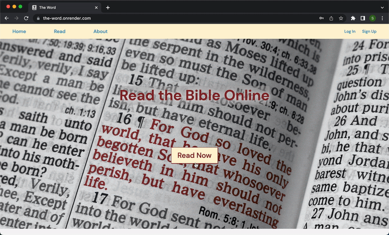
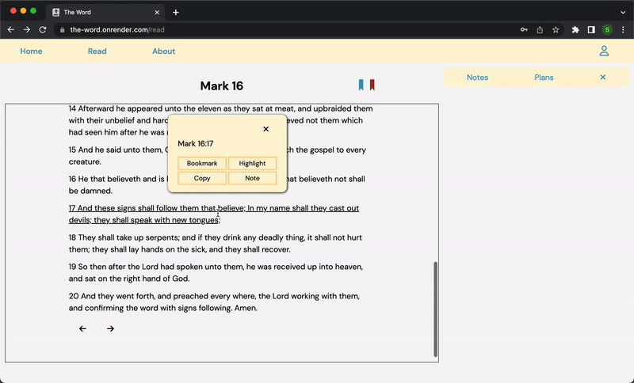
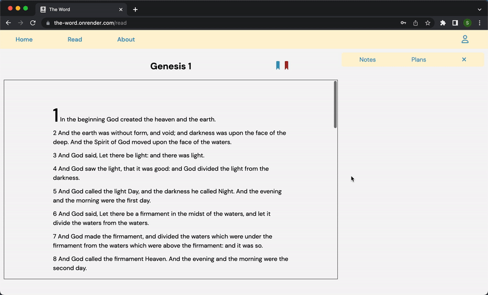
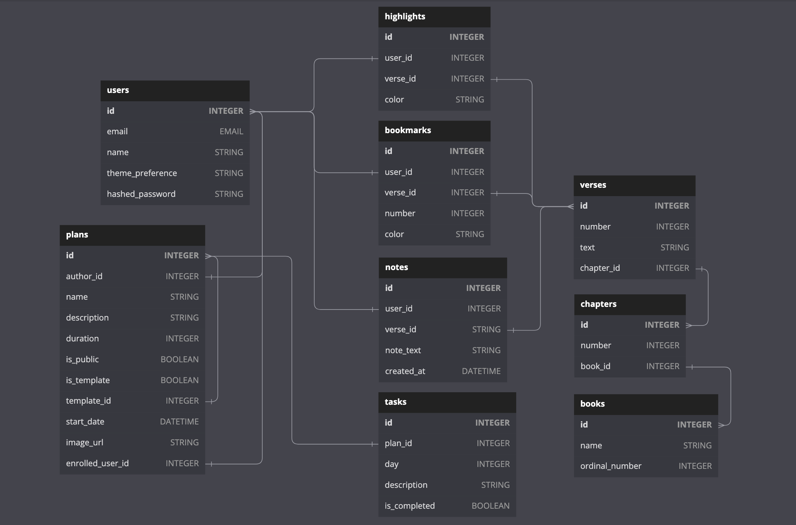

# The Word

The Word is a Bible app. It allows you to read and annotate your Bible, as well as create and follow reading plans to consistently stay in God's Word.

<a href='https://the-word.onrender.com/' target='_blank'></a>

## Technologies used:


<div align='center'>
<br>
  
  
  
  
  
  
  

  

</div>
<br>

## Landing Page:


## Read | Bookmark | Highlight:



## Notes:



## Plans:



<br>

## Features:

### Bible Navigation

* Logged out users can view verses, chapters, and books of the Bible
* Logged out users can easily navigate to a specific book/chapter/verse
* Users can utilize the convenient buttons for "Next" and "Previous" chapters

### New account creation, log in, log out, and guest/demo login

* Users can sign up, log in, and log out.
* Users can use a demo login to try the site.
* Users can't use certain features without logging in (like bookmarks, notes, and plans).
* Logged in users are directed to the Bible read page where they can see their notes and jump to where they left off using bookmarks.
* Logged out users are directed to a splash page.


### Notes
> * Signed-in users only:

* Users can attach notes to verses with their own text
* Users can edit their notes
* Users can delete their notes
* Users can see the list of all their notes, with an option to filter them

### Bookmarks
> * Signed-in users only:

* Users can bookmark verses (with custom color and tag)
* Users can easily navigate to the bookmarked verse
* Users can remove the bookmark

### Reading Plans
> * Signed-in users only:

* Users can enroll plans to read the Bible at a specific pace (with some options already provided)
* Users can create their own custom plans to read the Bible, setting specific tasks (like read 1 chapter everyday)
* Users have an option to make their own custom plan public (or keep it private)
* Users can unenroll plans
* Users can delete their own plans
* Users can edit their own plans
    * If the plan is public and someone else is enrolled in it, they will retain their own personal copy of that plan.

## Future Features

### Friends
> * Signed-in users only:
* Users can send and accept friend requests
* Users who are friends can message one another
    * Must be a live chat
* Users can optionally make their notes visible to other friends

### Study Groups
> * Signed-in users only:
* Users can group together and message each other in their group chat
    * Must be a live chat


## Possible Features

## Infinite scroll
* Users can scroll up and down infinitely without having to click "next" or "previous" chapter.

## Searching the Bible
* Users can search for key words/terms and that query will return relevant results

## Audio Bible
* Users can turn on the audio Bible as they read or off screen

# Documentation

## Database Schema Design




## API Routes

### Authentication

### -----------------------------
* URL: `/api/auth/`

* METHOD: `GET`

```
    Authenticates a user.
```

### -----------------------------
* URL: `/api/auth/login`

* METHOD: `POST`

```
    Logs a user in
```

### -----------------------------
* URL: `/api/auth/logout`

* METHOD: `GET`

```
    Logs a user out
```

### -----------------------------
* URL: `/api/auth/signup`

* METHOD: `POST`

```
    Creates a new user and logs them in
```

### -----------------------------
* URL: `/api/auth/unauthorized`

* METHOD: `GET`

```
    Returns unauthorized JSON when flask-login authentication fails
```

### Bible Routes

### -----------------------------
* URL: `/api/bible/<name>/<int:number>`

* METHOD: `GET`

```
    Get a single chapter by book name and chapter number
```

### -----------------------------
* URL: `/api/bible/books`

* METHOD: `GET`

```
    Get a list of all the books of the Bible in order
```

### Bookmarks

### -----------------------------
* URL: `/api/bookmarks`

* METHOD: `POST`

```
    Route to create a bookmark on a specific verse
```

### -----------------------------
* URL: `/api/bookmarks/<int:id>`

* METHOD: `DELETE`

```
    Route to delete a bookmark specified by id
```

### Highlights

### -----------------------------
* URL: `/api/highlights`

* METHOD: `POST`

```
    Route to create a highlight on a specific verse
```

### -----------------------------
* URL: `/api/highlights/<int:id>`

* METHOD: `DELETE`

```
    Route to delete a highlight specified by VERSE id
```

### Notes

### -----------------------------
* URL: `/api/notes`

* METHOD: `POST`

```
    Route to create a note on a specific verse
```

### -----------------------------
* URL: `/api/notes/<int:id>`

* METHOD: `PUT`

```
    Route to edit a note by note id
```

### -----------------------------
* URL: `/api/notes/<int:id>`

* METHOD: `DELETE`

```
    Route to delete a note by note id
```

### Plans

### -----------------------------
* URL: `/api/plans`

* METHOD: `GET`

```
    Route to get all PUBLIC reading plan TEMPLATES
```

### -----------------------------
* URL: `/api/plans`

* METHOD: `POST`

```
    Route to create a reading plan
```

### -----------------------------
* URL: `/api/plans/<int:id>`

* METHOD: `DELETE`

```
    Route to delete a reading plan
```

### -----------------------------
* URL: `/api/plans/<int:id>`

* METHOD: `PUT`

```
    Route to edit a reading plan
```

### -----------------------------
* URL: `/api/plans/<int:id>/image`

* METHOD: `PUT`

```
    Route to edit the image of a reading plan
```

### -----------------------------
* URL: `/api/plans/<int:id>/enroll`

* METHOD: `POST`

```
    Route to enroll (create a personal copy of) a plan by the template's plan_id
```

### -----------------------------
* URL: `/api/plans/<int:id>/unenroll`

* METHOD: `DELETE`

```
    Route to unenroll a plan by plan_id
```

### Tasks

### -----------------------------
* URL: `/api/tasks/<int:id>`

* METHOD: `PUT`

```
    Route to toggle tasks completed/not completed
```

### Users

### -----------------------------
* URL: `/api/users/`

* METHOD: `GET`

```
    Query for all users and returns them in a list of user dictionaries
```

### -----------------------------
* URL: `/api/users/<int:id>`

* METHOD: `GET`

```
    Query for a user by id and returns that user in a dictionary
```
